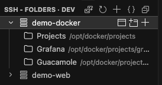
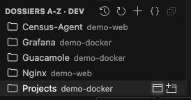
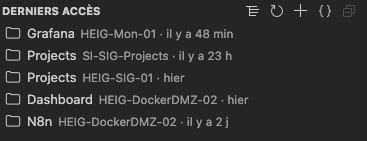

# SSH - Folders

Liste les hôtes SSH et des dossiers distants favoris. Remote-SSH ouvre la connexion.

[English version at the bottom of this page.](#english)

## Aperçu

Les images suivent le fichier d'exemple `examples/ssh-folders.example.json`. Les hôtes `demo-docker` et `demo-web` sont fictifs.

Le premier bouton en haut passe à la vue suivante. Les autres actualisent l'arbre, ajoutent un dossier, ou ouvrent le JSON.

### Vue par hôte

Les alias viennent du fichier SSH config. Chaque dossier favori est rangé sous son hôte, avec le chemin distant à côté du nom. Un clic sur l'hôte ouvre le dossier par défaut quand `defaults.DefaultFolder` est défini.

### Vue dossiers A-Z

Les noms sont triés, et l'hôte s'affiche à côté. Sans libellé, le nom du dossier est utilisé : `/etc/nginx` devient Nginx. Deux libellés qui partagent le même premier mot, par exemple Grafana et Grafana-dev, sont regroupés sous un même titre. Dans cette vue, une majuscule est aussi mise après un tiret.

### Vue derniers accès

L'historique est gardé par l'éditeur. Retirer une entrée laisse le favori en place.

## Français

### Fonctionnalités

- Les hôtes viennent du fichier SSH config (`~/.ssh/config`, ou `remote.SSH.configFile` s'il est défini).
- Un clic sur un hôte ou un dossier demande à Remote-SSH d'ouvrir la connexion.
- Les dossiers favoris s'ajoutent, se renomment et se suppriment depuis l'arbre.
- Chaque entrée s'ouvre dans la fenêtre courante ou dans une nouvelle fenêtre.
- La vue par hôte place les dossiers sous chaque hôte.
- La vue dossiers A-Z trie les noms et regroupe une même famille (`grafana` et `grafana-dev` sous Grafana).
- La vue derniers accès liste les connexions récentes. Retirer une entrée n'efface pas le favori.
- Un bouton en haut de l'arbre passe d'une vue à l'autre.
- Un dossier par défaut s'ouvre au clic sur l'hôte, à la place d'une fenêtre distante vide.

### Installation

Dans VS Code, ouvre Extensions et cherche `cedric217.ssh-folders`.

L'extension Remote - SSH doit être installée : c'est elle qui ouvre la session.

### Configuration

Les favoris sont dans `~/.ssh/extensions/ssh-folders.json`. Si le schéma `remote-folders.schema.json` n'est pas déjà à côté, l'extension l'y copie.

Au premier lancement, si ce JSON n'existe pas encore, l'extension le crée à partir de `examples/ssh-folders.example.json`. Dans le dépôt, cet exemple pointe vers `../schemas/remote-folders.schema.json` pour que l'éditeur trouve le schéma. Le fichier installé reçoit `"$schema": "./remote-folders.schema.json"`, à côté de la copie du schéma. Un fichier déjà présent reste tel quel.

L'exemple ne contient que les réglages déjà en place : `DefaultFolder`, `RecentLimit`, `path` et `label`. Il sera complété au fil des fonctions ajoutées.

Les hôtes `demo-docker` et `demo-web` sont fictifs. Les adresses `203.0.113.10` et `203.0.113.20` servent uniquement à la documentation. Pour les voir dans la vue par hôte, copie à la main les blocs de `examples/ssh-config.example` dans ton fichier SSH config. L'extension laisse ce fichier intact. La vue A-Z affiche ces dossiers dès que le JSON d'exemple est en place, car elle lit les favoris directement.

Ces entrées de démonstration se retirent depuis l'arbre, comme les autres favoris.

La clé (`demo-docker` dans l'exemple) est l'alias de la ligne `Host` dans `~/.ssh/config`, pas le nom DNS (`HostName`). La casse est ignorée : `MyServer` et `myserver` désignent le même hôte. La connexion utilise l'orthographe du fichier SSH config.

~~~json
{
  "$schema": "./remote-folders.schema.json",
  "defaults": {
    "DefaultFolder": "/opt/docker/projects",
    "RecentLimit": 20
  },
  "folders": {
    "demo-docker": [
      {
        "path": "/opt/docker/projects",
        "label": "Projects"
      },
      {
        "path": "/opt/docker/projects/grafana",
        "label": "Grafana"
      },
      {
        "path": "/opt/docker/projects/guacamole",
        "label": "Guacamole"
      }
    ],
    "demo-web": [
      {
        "path": "/opt/docker/projects/census-agent",
        "label": "Census-agent"
      },
      {
        "path": "/etc/nginx"
      }
    ]
  }
}
~~~

Modèle SSH, à coller soi-même. Il correspond à `examples/ssh-config.example`.

~~~text
Host demo-docker
  HostName 203.0.113.10
  User demo

Host demo-web
  HostName 203.0.113.20
  User demo
~~~

Chaque objet est un dossier de cet hôte. `path` est le chemin distant, `label` le nom affiché. Plusieurs objets sont plusieurs favoris du même hôte. Si `label` est absent, le nom du dossier est utilisé.

Le chemin est POSIX et absolu (`/...`).

`defaults.DefaultFolder` sert à tous les hôtes. Le bouton + préremplit le chemin avec cette valeur, et propose comme nom la partie qui suit ce dossier. Exemple : `/opt/docker/projects/grafana` donne `grafana`.

`defaults.RecentLimit` fixe la taille de la vue derniers accès (20 par défaut, de 1 à 100). L'historique est gardé par l'éditeur, pas dans ce JSON.

Autre emplacement du fichier de favoris : le réglage `sshFolders.configPath`.

## English

The pictures at the top follow `examples/ssh-folders.example.json`. Hosts `demo-docker` and `demo-web` are fictional.

### Features

- Hosts come from the SSH config file (`~/.ssh/config`, or `remote.SSH.configFile` when that setting is set).
- A click on a host or a folder asks Remote-SSH to open the connection.
- Favorite folders can be added, renamed, and removed from the tree.
- Each entry opens in the current window or in a new window.
- The by-host view lists folders under each host.
- The A-Z view sorts names and groups a family together (`grafana` and `grafana-dev` under Grafana).
- The recent view lists the latest connections. Removing an entry does not delete the favorite.
- A button at the top of the tree switches from one view to the next.
- A default folder opens when you click a host, instead of an empty remote window.

### Installation

In VS Code, open Extensions and search for `cedric217.ssh-folders`.

The Remote - SSH extension must be installed: it is the one that opens the session.

### Configuration

Favorites live in `~/.ssh/extensions/ssh-folders.json`. If `remote-folders.schema.json` is not already next to that file, the extension copies it there.

On first launch, if that JSON file does not exist yet, the extension creates it from `examples/ssh-folders.example.json`. In the repository, that example points at `../schemas/remote-folders.schema.json` so the editor can find the schema. The installed file gets `"$schema": "./remote-folders.schema.json"`, next to the copied schema. A file that is already there stays as it is.

The example only includes settings that already exist: `DefaultFolder`, `RecentLimit`, `path`, and `label`. It will grow as new features land.

Hosts `demo-docker` and `demo-web` are fictional. Addresses `203.0.113.10` and `203.0.113.20` are documentation addresses only. To see them in the by-host view, paste the blocks from `examples/ssh-config.example` into your SSH config yourself. The extension leaves that file untouched. The A-Z view still lists these folders once the example JSON is in place, because that view reads the favorites directly.

Demo entries can be removed from the tree, the same way as any other favorite.

The key (`demo-docker` in the example) is the `Host` alias from `~/.ssh/config`, not the DNS name (`HostName`). Case is ignored: `MyServer` and `myserver` are the same host. The connection uses the spelling from the SSH config file.

~~~json
{
  "$schema": "./remote-folders.schema.json",
  "defaults": {
    "DefaultFolder": "/opt/docker/projects",
    "RecentLimit": 20
  },
  "folders": {
    "demo-docker": [
      {
        "path": "/opt/docker/projects",
        "label": "Projects"
      },
      {
        "path": "/opt/docker/projects/grafana",
        "label": "Grafana"
      },
      {
        "path": "/opt/docker/projects/guacamole",
        "label": "Guacamole"
      }
    ],
    "demo-web": [
      {
        "path": "/opt/docker/projects/census-agent",
        "label": "Census-agent"
      },
      {
        "path": "/etc/nginx"
      }
    ]
  }
}
~~~

SSH sample to paste yourself. It matches `examples/ssh-config.example`.

~~~text
Host demo-docker
  HostName 203.0.113.10
  User demo

Host demo-web
  HostName 203.0.113.20
  User demo
~~~

Each object is one folder on that host. `path` is the remote path, `label` is the name shown. Several objects are several favorites of the same host. If `label` is missing, the folder name is used.

The path is POSIX and absolute (`/...`).

`defaults.DefaultFolder` applies to every host. The + button prefills the path with that value and suggests the name from the part that follows this folder. Example: `/opt/docker/projects/grafana` becomes `grafana`.

`defaults.RecentLimit` sets the size of the recent view (20 by default, from 1 to 100). History is stored by the editor, not in this JSON file.

To store favorites elsewhere, set `sshFolders.configPath`.
